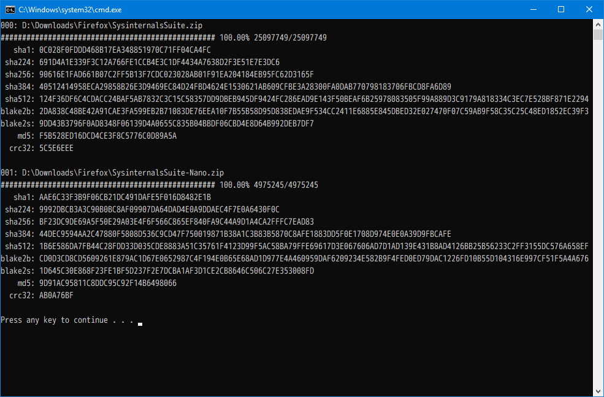

# Hash It

Calculate hash of file easily.

## Environment

- Python 3.6.x
- `pip install pyyaml`

## Start

1. 運行 `bat.py`，生成 `hashit.bat`；（每次改變 Script 所在資料夾都需要執行）
2. 編輯 `setting.py`，設定；
3. 將要計算 hash 的文件拖到被生成的 `hashit.bat`上。

## Features

- 批量處理
- 進度條（Progress Bar）
- `sha1`, `sha224`, `sha256`, `sha384`, `sha512`, `blake2b`, `blake2s`, `md5`, `crc32`
